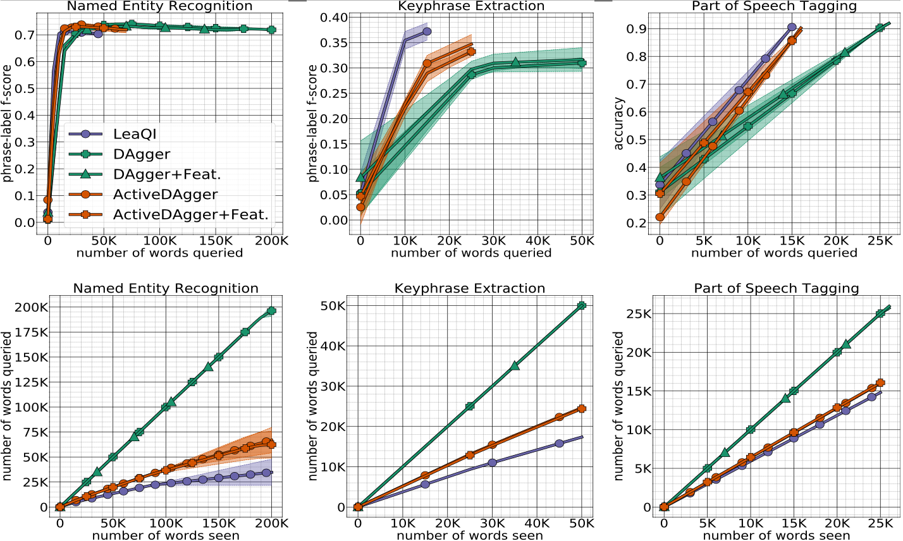

# Active Imitation Learing with Noisy Guidance

This repository implements the algorithms presented in the [paper]()

## Dependencies

* We advise the reader to use virtualenv so that installing dependencies is easy
* Note that the code only works on a single gpu and have not been tested for multi-gpu

## Installation

```bash
python -m pip install -e .
```

## Code Arguments 

```bash
> python -u run.py --help
usage: main.py [-h] [--num_epochs NUM_EPOCHS] [--b B] [--seed SEED]
               [--alpha ALPHA] [--model_lr MODEL_LR] [--task {multi,ner,gym}]
               [--filename FILENAME] [--weak_feature]
               [--env {Ner-v0,Keyphrase-v0,Pos-v0}] [--no_apple_tasting]
               [--method {mm,smentropy,lc}] [--diff_clf_lr DIFF_CLF_LR]
               [--diff_clf_type {gradient,adj_prob,entropy}]
               [--diff_clf_th DIFF_CLF_TH] [--diff_clf_fn_g DIFF_CLF_FN_G]
               [--unbias_weight] [--betadistro {1,query}]
               [--ref_type {normal,random}]
               [--alg {dagger:strong,dagger:weak,leaqi}]
               [--query_strategy {active,passive,None,random}]
```

## Running the code

To run the experiments, go to the directory `leaqi/`,

for the different environments:
  * Keyphrase use the flag `--env Keyphraes-v0`
  * Part-of-Speech use the flag `--env Pos-v0`
  * Named entity recognition use the flag `--env Ner-v0`
  
for different instantions of our algorithm:
  * Turning Apple Tasting off `--no_apple_tasting`
  * Random Reference `--ref_type normal`
  
Commands to reproduce LeaQI results:
  * Keyphrase , run `python -u main.py --env Keyphraes-v0`
  * Part-of-Speech , run `python -u main.py --env Pos-v0`
  * Named entity recognition, run `python -u main.py --env Ner-v0`
  
Commands to reproduce baseline results:
  * Keyphrase Normal DAgger, run `python -u main.py --env Keyphraes-v0 --alg dagger:strong --query_strategy passive`
  * Keyphrase Active DAgger, run `python -u main.py --env Keyphraes-v0 --alg dagger:strong --query_strategy active`
  * Part-of-Speech Normal DAgger, run `python -u main.py --env Pos-v0 --alg dagger:strong --query_strategy passive`
  * Part-of-Speech Active DAgger, run `python -u main.py --env Pos-v0 --alg dagger:strong --query_strategy active`
  * Named entity recognition Normal DAgger, run `python -u main.py --env Ner-v0 --alg dagger:strong --query_strategy passive`
  * Named entity recognition Active DAgger, run `python -u main.py --env Ner-v0 --alg dagger:strong --query_strategy active`
  
  
## Empirical evaluation
Empirical evaluation on three sequential decision making problems: (left-column) English named entity recognition, (middle-column) English keyphrase extraction and (right-column) low-resource language part of speech tagging on Greek, Modern (el).         The top-row shows the performance (f-score or accuracy) with respect to the number of words queried. The bottom-row shows the number words queried with respect to number of words seen

